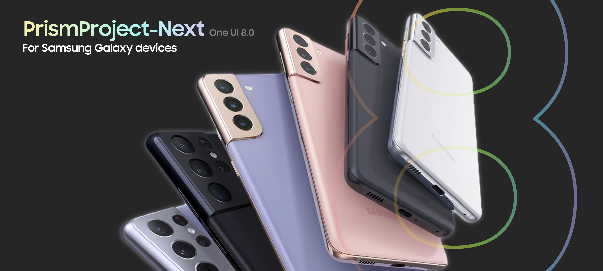

<h1 align="center">
  
</h1>

PrismProject-Next는 국내판 삼성 갤럭시 기기를 위한 커스텀 펌웨어 프로젝트입니다.

# PrismProject-Next란 무엇인가요?
PrismProject-Next는 국내판 삼성 갤럭시 기기를 위한 커스텀 펌웨어 프로젝트로, 구형 디바이스에서도 최적화된 최신 One UI 경험을 제공하는 것을 목표로 합니다.

이 프로젝트는 삼성의 최신 One UI를 기반으로 하며, 순정 소프트웨어의 안정성과 일체감을 유지하면서도 다양한 개선 사항, 최적화 및 추가 기능을 제공합니다.

이 프로젝트는 UN1CA 빌드 시스템을 사용하여 필요한 도구를 자동으로 빌드하고, 펌웨어를 다운로드 및 추출한 후, 필요한 패치 및 모드를 적용하여 플래싱 가능한 ZIP 파일을 생성합니다.

이 프로젝트의 목표는 국내판 삼성 갤럭시 기기에 최적화된 환경을 제공하는 동시에, 최신 소프트웨어 경험 및 향상된 사용자 경험을 제공하는 것입니다.

프로젝트에 대한 모든 형태의 기여, 제안, 버그 보고 또는 기능 요청을 환영합니다.

# 기능
### 핵심 기능:
- 최신 갤럭시 S22 One UI 8.0 펌웨어 기반
- Galaxy AI 전체 지원
- 갤럭시 S25 배경화면 및 사운드 적용
- EROFS 파일 시스템 적용
- 플래그십 UI 효과 (애니메이션, 라이브 블러, AOD) 지원
- 플래그십 디스플레이 기능 (색상 최적화, 가변 주사율, 더 밝게, 야외 모드) 지원
- 플래그십 이미지 기능 (사진 리마스터, AI 지우개, 이미지 클리퍼) 지원
- 삼성 녹스 애플리케이션 사용 가능 (삼성 월렛, 패스 제외)
- 카메라 셔터음 토글 지원
- 멀티 사용자 지원
- Samsung DeX(무선) 지원
- 불필요한 시스템 서비스 및 블로트웨어 제거
- 모든 앱에서 듀얼 메신저 지원
- 커스텀 FlipFont 폰트 지원
- 4자리 PIN 자동 잠금 해제
- [BluetoothLibraryPatcher](https://github.com/3arthur6/BluetoothLibraryPatcher) 통합
- [KnoxPatch](https://github.com/salvogiangri/KnoxPatch) 통합
- 기타 CSC 트윅 적용 (Hiya, 상태 표시줄 네트워크 속도, AltZLife, 카메라 셔터음 토글)
- build.prop 트윅 내장
- 순정에 가까운 경험

\* USB-C DP 미지원 기기에서는 HDMI를 통한 DeX 사용이 불가능합니다.

# 라이선스
이 프로젝트는 [GNU 일반 공중 사용 허가서 v3.0](LICENSE) 라이선스를 따릅니다. 외부 종속성은 다음과 같은 라이선스 하에 배포됩니다:
- [android-tools](https://github.com/nmeum/android-tools) - [Apache License 2.0](https://github.com/nmeum/android-tools/blob/master/LICENSE) 하에 배포
- [apktool](https://github.com/iBotPeaches/Apktool) - [Apache License 2.0](https://github.com/iBotPeaches/Apktool/blob/master/LICENSE.md) 하에 배포
- [erofs-utils](https://github.com/sekaiacg/erofs-utils/) - 이중 라이선스 ([GPL-2.0](https://github.com/sekaiacg/erofs-utils/blob/dev/LICENSES/GPL-2.0), [Apache-2.0](https://github.com/sekaiacg/erofs-utils/blob/dev/LICENSES/Apache-2.0))
- [img2sdat](https://github.com/xpirt/img2sdat) - [MIT License](https://github.com/xpirt/img2sdat/blob/master/LICENSE) 하에 배포
- [platform_build](https://android.googlesource.com/platform/build/) (ext4_utils, f2fs_utils, signapk) - [Apache License 2.0](https://source.android.com/docs/setup/about/licenses) 하에 배포

# 크레딧
- **[Quasar](https://github.com/quasar-0707)** - 프로젝트 주도, 배너 제작, 빌드 시스템 한글화, S21 시리즈 지원, ROM 모드 제작
- **[salvogiangri](https://github.com/salvogiangri)** - UN1CA 빌드 시스템, ROM 패치, 모드 제작

## 원본 UN1CA 크레딧
A special thanks goes to the following for their invaluable contributions in no particular order:
- **[ShaDisNX255](https://github.com/ShaDisNX255)** for his help, time and for his [NcX ROM](https://github.com/ShaDisNX255/NcX_Stock) which inspired this project
- **[DavidArsene](https://github.com/DavidArsene)** for his help and time
- **[paulowesll](https://github.com/paulowesll)** for his help and support
- **[Simon1511](https://github.com/Simon1511)** for his support and some of the device-specific patches
- **[ananjaser1211](https://github.com/ananjaser1211)** for troubleshooting and his time
- **[Fede2782](https://github.com/Fede2782)** for his contributions and help with Exynos/MTK support
- **[iDrinkCoffee](https://github.com/iDrinkCoffee-TG)** and **[RisenID](https://github.com/RisenID)** for their support
- **[LineageOS Team](https://www.lineageos.org/)** for their original [OTA updater implementation](https://github.com/LineageOS/android_packages_apps_Updater)
- *All the UN1CA project forks, contributors, testers and users ❤️*
